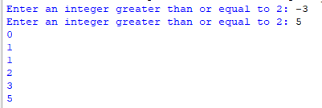
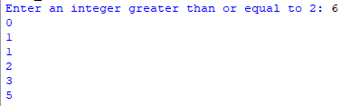

## Description 
The Fibonacci sequence is a series of numbers where each term is the sum of the two preceding terms.  
This program prompts the user to enter an integer greater than or equal to 2, and it calculates and displays all Fibonacci sequence terms up to and including 'n,' without exceeding the provided value.  
## Example 
♡ Example 1  
  
♡ Example 2    

